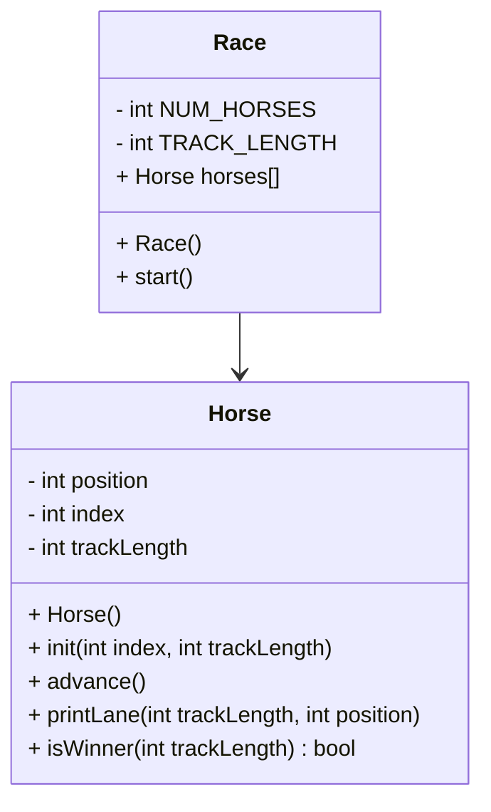

# CS121-Project-4-Horse-Game-Java



## Race : Race()
```
const int TRACK_LENGTH
const in NUM_HORSES

create an array of Horses length NUM_HORSES
initialize all the horses
for each horse
    initialize that horse with its index and the track length
```
## Race : start()
```
seed randomNum
bool keepGoing
while keepGoing:
    go through each horse:
        advance that horse
        print that horse's lane
        if that horse is in the winning spot:
            make keepGoing false
```

## Horse : Horse()
```
position = 0
index = 0
trackLength = 15
```

## void Horse : Horse::init(int index, int trackLength)
```
horse:index = index
horse:trackLength = trackLength
horse:position = 0
```

## void Horse : advance()
```
make a number between 1 and 0 and put it in an int variable
add that value in the variable to the horse position
```

## void Horse : printLane()
```
char lane[trackLength]
for tracklength
    lane[i] = '*'
lane[Horse:position] = Horse:index
```

## bool Horse:isWinner()
```
bool winning = false

if position >= trackLength
    winning = true

return winning
```
